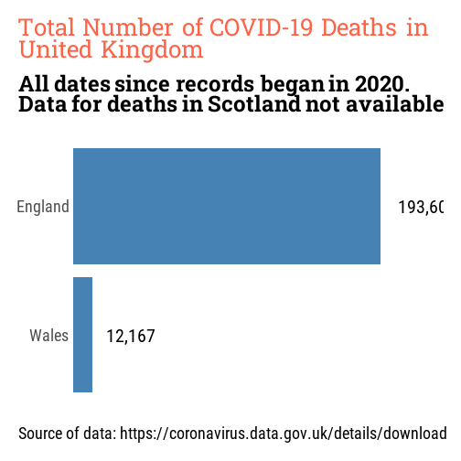

```r
# Purpose:			Initial exploratory data analysis
# Created by:   Cox, Graham
# Created on:   2024-01-02

# Load functions ----

source("00_library_load.R")
source("02_theme_load.R")

theme_load()

# Load Data ----

df <- read_csv("data.csv",
							 show_col_types = FALSE) %>%
	mutate(
		new_ons_deaths_by_registration_date = ifelse(
			is.na(new_ons_deaths_by_registration_date),
			0,
			new_ons_deaths_by_registration_date
		)
	)

df$new_ons_deaths_by_registration_date <-
	replace(is.na(df$new_ons_deaths_by_registration_date), 0)
```

```
## Error in replace(is.na(df$new_ons_deaths_by_registration_date), 0): argument "values" is missing, with no default
```

```r
# Analysis data ----

# Cases per country
df %>%

	# Select required variables
	select(country, new_cases_by_specimen_date) %>%

	# Summarise by country
	summarise(total_cases = sum(new_cases_by_specimen_date),
						.by = "country") %>%

	# Arrange order of total_cases
	arrange(total_cases) %>%

	# start plot
	ggplot(aes(total_cases, reorder(country, total_cases))) +

	# add geometry
	geom_col(fill = "steelblue") +

	# add labels
	labs(
		title = "Total Number of COVID-19 Cases in United Kingdom",
		subtitle = "All dates since records began in 2020",
		x = NULL,
		y = NULL,
		caption = "Source of data: https://coronavirus.data.gov.uk/details/download"
	) +

	# Amend scales
	scale_x_continuous(expand = expansion(mult = c(0, .2)), labels = NULL) +

	# Add data labels
	geom_text(
		aes(
			x = total_cases,
			y = country,
			label = comma(total_cases)
		),
		hjust = -.3,
		family = "roboto-condensed",
		size = 3.5
	)
```


```r
# Create filename
filename <- "03_01_plot.png"

# Save plot as png file
ggsave(
	filename,
	plot = last_plot(),
	width = 9,
	height = 6,
	dpi = 144,
	units = "in",
	bg = "white"
)

# Deaths per country
df %>%

	# Select required variables
	select(country, new_ons_deaths_by_registration_date) %>%

	filter(country != "Scotland") %>%

	# Summarise by country
	summarise(total_deaths = sum(new_ons_deaths_by_registration_date),
						.by = "country") %>%

	# Arrange order of total_cases
	arrange(total_deaths) %>%

	# start plot
	ggplot(aes(total_deaths, reorder(country, total_deaths))) +

	# add geometry
	geom_col(fill = "steelblue") +

	# add labels
	labs(
		title = "Total Number of COVID-19 Deaths in United Kingdom",
		subtitle = "All dates since records began in 2020. Data for deaths in Scotland not available",
		x = NULL,
		y = NULL,
		caption = "Source of data: https://coronavirus.data.gov.uk/details/download"
	) +

	# Amend scales
	scale_x_continuous(expand = expansion(mult = c(0, .2)), labels = NULL) +

	# Add data labels
	geom_text(
		aes(
			x = total_deaths,
			y = country,
			label = comma(total_deaths)
		),
		hjust = -.3,
		family = "roboto-condensed",
		size = 3.5
	)
```



```r
# Create filename
filename <- "03_02_plot.png"

# Save plot as png file
ggsave(
	filename,
	plot = last_plot(),
	width = 9,
	height = 6,
	dpi = 144,
	units = "in",
	bg = "white"
)
```

